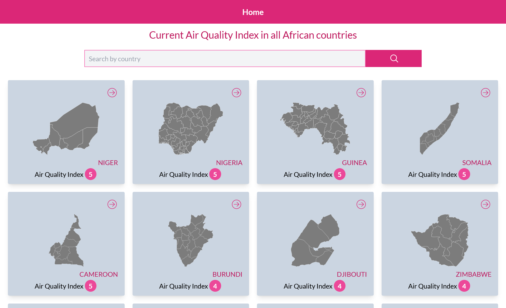
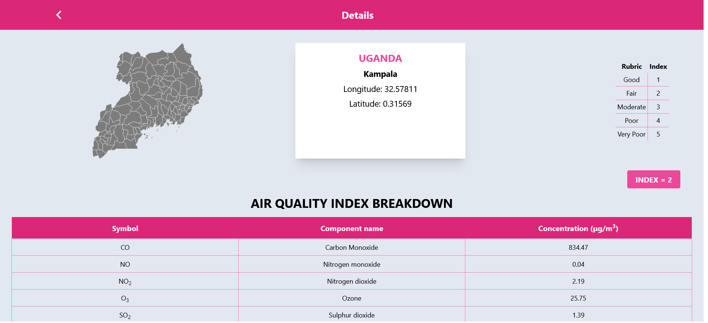
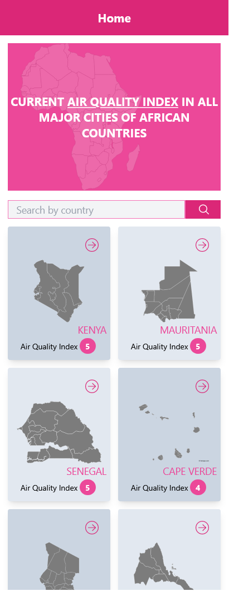
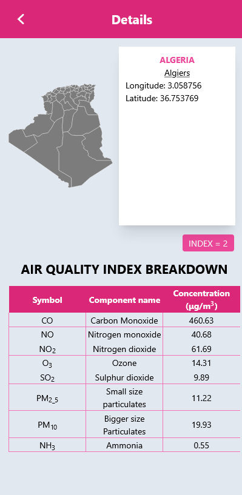

# AQI Africa

This is a simple web application that consumes the open weather api targeting specifically the air pollution data. This is live data from all major cities in all african countries.

## Built With

- Major languages: React, Javascript and tailwindCSS
- Technologies used: Redux, Linters, Create react app, Git, Github and Gitflow,

## App outlook

**Desktop version**
_Home page_

_Details page_


**Mobile**





## video description

[https://www.loom.com/share/cce6c0315bac477888be7f3e2febf955](https://www.loom.com/share/cce6c0315bac477888be7f3e2febf955)

## Live Demo (if available)

h[ttps://luxury-begonia-7d2330.netlify.app/](https://luxury-begonia-7d2330.netlify.app/)

## Getting Started

### Prerequisites

You should be having [Node.js](https://nodejs.org/en/) installed on your computer

### Setup

To get a local copy up and running follow these simple example steps.

1. Navigate to a folder where you want the cloned file to appear

2. Clone this repo in your terminal or git bash using the command

   ```
   git@github.com:John-Kibirige/aqi-africa.git
   ```

3. run `npm install ` to install all the necessary dependencies including the linters

4. Navigate to the folder called aqi-africa and open this project in your editor

### Setting up the server up and running

run `npm start` to start the development server

### Run tests

These were linter tests mainly

- Html, run `npx stylelint "**/*.{css,scss}"`
- Javascript and jsx `npx eslint .`

### Deployment
Deployed at netlify 

## Author

👤 **Kibirige John**

- Github: [John-Kibrige](https://github.com/John-Kibirige)
- Twitter: [kibirigejohn005](https://twitter.com/kibirigejohn005)
- LinkedIn: [Kibirige John](https://www.linkedin.com/in/kibirige-john-64160520a/trk=public_profile_samename-profile_profile-result-card_result-card_full-click&original_referer=https%3A%2F%2Fwww%2Egoogle%2Ecom%2F&originalSubdomain=ug)

## 🤝 Contributing

Contributions, issues, and feature requests are welcome!

Feel free to check the [issues page](https://github.com/John-Kibirige/aqi-africa/issues).

## Show your support

Give a ⭐️ if you like this project!

## Acknowledgments

 - [Original design idea by Nelson Sakwa on Behance](https://www.behance.net/gallery/31579789/Ballhead-App-%28Free-PSDs%29)

## 📝 License

This project is [MIT](LICENSE) licensed.
